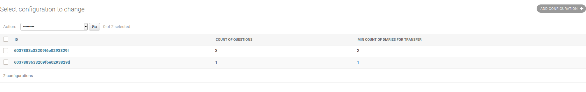
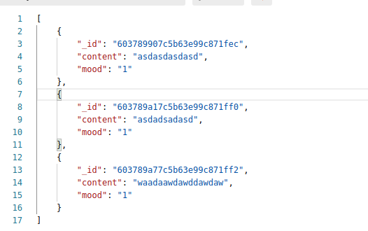

# Diary App

## Pre-requirements:
- tesseract-ocr-eng
- tesseract-ocr-rus
- opencv (python3-opencv)

## Start project (without docker)
```sh
$ pip3 install -r requirements.txt
$ python3 manage.py makemigrations
$ python3 manage.py migrate
$ python3 manage.py runserver
```
## Start project (with docker)
```sh
$ docker-compose build
$ docker-compose up -d
```

## Working with `Configuration`
### "Active" configuration is latest (updated or created)

> `The first configuration is "active" in this photo`
### Here the example of response 


